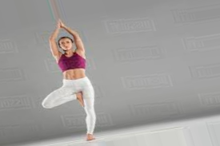

# Pose Correction

<!-- [](https://wakatime.com/badge/github/Grover101/Pose-Correction) -->

# Herramientas y Tecnologias

# Procesos del Proyecto

- [x] Obtener Dataset
- [x] Creacion de Dataset
- [x] Data Augmentation
- [ ] Normalizacion y Procesamiento de Datos
- [ ] Creacion de Modelo
- [ ] Resultados de Entrenamiento
- [ ] Uso de Modelo para Javascript
- [ ] Creacion de Servicio Web
- [ ] Uso de Modelo en Web
- [ ] Resultado Final

## 1. Obtener Dataset

[](https://drive.google.com/drive/folders/1A5BjyqNvs_q7EfUhTdcNEiesZ8IVxMF2?usp=sharing)

```
   img/
    |__ no_pose/
    |    |__ (1).jpg
    |    |__ ...
    |__ shoudler_stand/
    |    |__ (1).jpg
    |    |__ ...
    |__ traingle/
    |    |__ (1).jpg
    |    |__ ...
    |__ tree/
    |    |__ (1).jpg
    |    |__ ...
    |__ warrior/
         |__ (1).jpg
         |__ ...
```

## 2. Creacion de Dataset

Para crear el dataset a partir de las imagenes ejecutar:

```
python dataset.py
```

```
   dataset/
   |__ train/
       |__ warrior/
       |   |______ (1).jpg
       |   |______ ...
       |__ ...
   |__ test/
       |__ warrior/
       |   |______ (25).jpg
       |   |______ ...
       |__ ...
```

<!-- [text](https://github.com/amalaj7/Pose-Estimation-TFLite) -->

## 3. Data Augmentation

Para crear el dataset augmentation a partir de las imagenes ejecutar:

```
python augmentation.py
```

Para volver a tener el dataset principal con el dataset_augmentation ejecutar:

```
python dataset.py 'augmentation'
```

### Resultados de 5 imagenes generadas a partir de una

| Imagen Original                                     | 1                                                         | 2                                                         | 3                                                         | 4                                                         | 5                                                         |
| --------------------------------------------------- | --------------------------------------------------------- | --------------------------------------------------------- | --------------------------------------------------------- | --------------------------------------------------------- | --------------------------------------------------------- |
| .png>) |  |  |  |  |  |

## 4. Normalizacion y Procesamiento de Datos

## 5. Creacion de Modelo


## Puntos a tomar en cuenta


0: nose \ 1: left_eye \ 2: right_eye \ 3: left_ear \ 4: right_ear \ 5: left_shoulder \ 6: right_shoulder \ 7: left_elbow \ 8: right_elbow \ 9: left_wrist \ 10: right_wrist \ 11: left_hip \ 12: right_hip \ 13: left_knee \ 14: right_knee \ 15: left_ankle \ 16: right_ankle

[Prueba del modelo](https://storage.googleapis.com/tfjs-models/demos/pose-detection/index.html?model=movenet)
