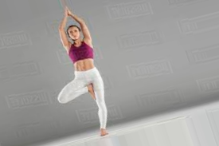
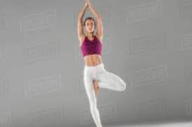
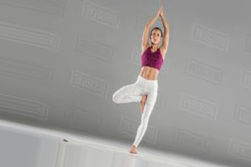
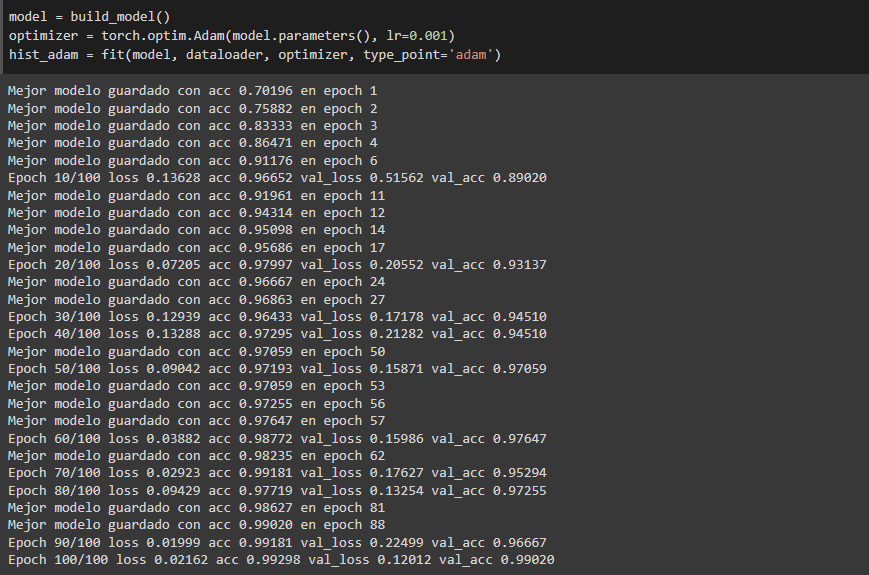
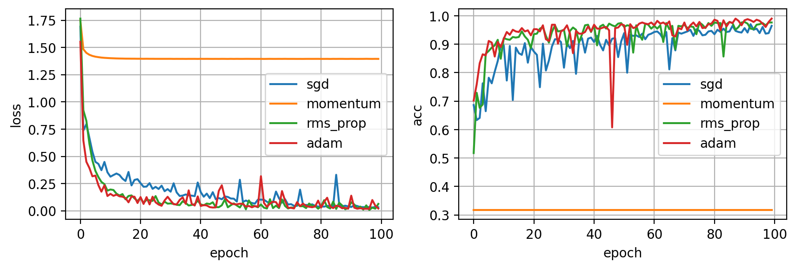

# Pose Correction

<!-- [](https://wakatime.com/badge/github/Grover101/Pose-Correction) -->

# Herramientas y Tecnologias

# Procesos del Proyecto

- [x] Obtener Dataset
- [x] Creacion de Dataset
- [x] Data Augmentation
- [x] Normalizacion y Procesamiento de Datos
- [x] Creacion de Modelo
- [x] Resultados de Entrenamiento
- [x] Uso de Modelo para Javascript
- [ ] Creacion de Servicio Web
- [ ] Uso de Modelo en Web
- [ ] Resultado Final

## 1. Obtener Dataset

[](https://drive.google.com/drive/folders/1A5BjyqNvs_q7EfUhTdcNEiesZ8IVxMF2?usp=sharing)

```
   img/
    |__ no_pose/
    |    |__ (1).jpg
    |    |__ ...
    |__ shoudler_stand/
    |    |__ (1).jpg
    |    |__ ...
    |__ traingle/
    |    |__ (1).jpg
    |    |__ ...
    |__ tree/
    |    |__ (1).jpg
    |    |__ ...
    |__ warrior/
         |__ (1).jpg
         |__ ...
```

## 2. Creacion de Dataset

Para crear el dataset a partir de las imagenes ejecutar:

```
python dataset.py
```

```
   dataset/
   |__ train/
       |__ warrior/
       |   |______ (1).jpg
       |   |______ ...
       |__ ...
   |__ test/
       |__ warrior/
       |   |______ (25).jpg
       |   |______ ...
       |__ ...
```

<!-- [text](https://github.com/amalaj7/Pose-Estimation-TFLite) -->

## 3. Data Augmentation

Para crear el dataset augmentation a partir de las imagenes ejecutar:

```
python augmentation.py
```

Para volver a tener el dataset principal con el dataset_augmentation ejecutar:

```
python dataset.py 'augmentation'
```

### Resultados de 5 imagenes generadas a partir de una

| Imagen Original                                     | 1                                                         | 2                                                         | 3                                                         | 4                                                         | 5                                                         |
| --------------------------------------------------- | --------------------------------------------------------- | --------------------------------------------------------- | --------------------------------------------------------- | --------------------------------------------------------- | --------------------------------------------------------- |
| .png>) |  |  |  |  |  |

## 4. Normalizacion y Procesamiento de Datos

Para la normalizacion y procesamiento de datos se fue leyendo cada imagen de cada clase, se usa `movenet` para la lectura de puntos del cuerpo:

### Documentacion base

[](https://tfhub.dev/google/movenet/singlepose/lightning/4)

### Puntos a tomar en cuenta

[](https://storage.googleapis.com/tfjs-models/demos/pose-detection/index.html?model=movenet)


El dataset a formarse sera un `*.csv` tanto para **train** y **test** por cada imagen se capturara los puntos con las coordenas `(x, y)` de acuerdo a la imagen de referencia correspondiente, se ira guardando por cada clase de postura de yoga. Haciendo un total de 34 columnas y una mas para la clase de postura de yoga.

## 5. Creacion de Modelo

Se usara un modelo Perceptrón Multicapa (Multi Layer Perceptron) `MLP`


Para ello se uso la siguiente configuracion:

- Batch size 10
- Epoch 100
- Dropout con una probabilidad de eliminacion de 0.5
- Funcion de activacion Relu y Softmax
- Funcion de perdida CrossEntropyLoss
- Optimizador Adam
- Learning rate de 0.001

## 6. Resultados y conclusion de Entrenamiento

[](notebooks/Creacion_de_modelo.ipynb)

### Entrenamiento



### Regularizacion

| Regularizador             | loss    | acc     | val_loss | val_acc |
| ------------------------- | ------- | ------- | -------- | ------- |
| Regularizacion L2 (Lasso) | 1.40019 | 0.41447 | 1.43534  | 0.31765 |
| Early Stopping            | 1.40179 | 0.41433 | 1.43928  | 0.31765 |
| Dropout                   | 1.39696 | 0.41433 | 1.44277  | 0.31765 |

### Optimizadores

| Optimizador                                      | loss    | acc     | val_loss | val_acc |
| ------------------------------------------------ | ------- | ------- | -------- | ------- |
| SGD (‘Stochastic Gradient Descent‘) + Dropout    | 0.03281 | 0.98947 | 0.09477  | 0.9641  |
| SGD Momentum + Dropout                           | 1.39540 | 0.41447 | 1.43488  | 0.31765 |
| RMSprop (Root Mean Square Propagation) + Dropout | 0.06392 | 0.98480 | 0.21004  | 0.97647 |
| Adam (Adaptive moment estimation) + Dropout      | 0.02162 | 0.99298 | 0.12012  | 0.99020 |



## 7. Uso de Modelo para Javascript
